 
 

## The Developer Behind the Code

I am a Full-stack Developer from Vietnam who turns complex business requirements into simple, useful web applications. My work sits between two worlds:

- **Backend** — APIs, business rules, data models, authentication flows, and reliable integrations with **ASP.NET Core** and **PostgreSQL**.
- **Frontend** — responsive, maintainable interfaces with **Angular**, **TypeScript**, and reusable UI components.

> Good software is not just code that works — it is code that people can trust, maintain, and evolve.

## My Engineering Toolkit

<table>
  <tr>
    <td valign="top" width="50%">

### Backend & Data

- ASP.NET Core & Web API
- C# & Entity Framework Core
- PostgreSQL & database design
- REST APIs & OpenAPI / Swagger
- Authentication & authorization
- Clean Architecture principles

    </td>
    <td valign="top" width="50%">

### Frontend & Experience

- Angular & TypeScript
- RxJS & reactive programming
- Responsive web interfaces
- Reactive forms & validation
- Reusable component design
- API integration & HTTP interceptors

    </td>
  </tr>
</table>

### Delivery & Collaboration

`Git` · `GitHub` · `Azure DevOps` · `Docker` · `Postman` · `Swagger` · `Visual Studio` · `VS Code`

## How I Like to Work

- I prefer clarity over unnecessary complexity.
- I build for maintainability, not only for the current feature.
- I collaborate through clean Git history, useful code reviews, and practical documentation.
- I keep security in mind: secrets stay out of source control, and APIs have clear authentication and validation boundaries.

## Currently Exploring

- Modular monolith and Clean Architecture patterns in ASP.NET Core
- Advanced Angular architecture and scalable component systems
- Dockerized development environments
- Automated testing and CI/CD workflows
- Cloud-ready application design

## Contribution Activity

<picture>
  <source media="(prefers-color-scheme: dark)" srcset="https://raw.githubusercontent.com/ngduytan1811/ngduytan1811/output/github-contribution-grid-snake-dark.svg" />
  <source media="(prefers-color-scheme: light)" srcset="https://raw.githubusercontent.com/ngduytan1811/ngduytan1811/output/github-contribution-grid-snake.svg" />
  
</picture>

### Let’s build something useful.

